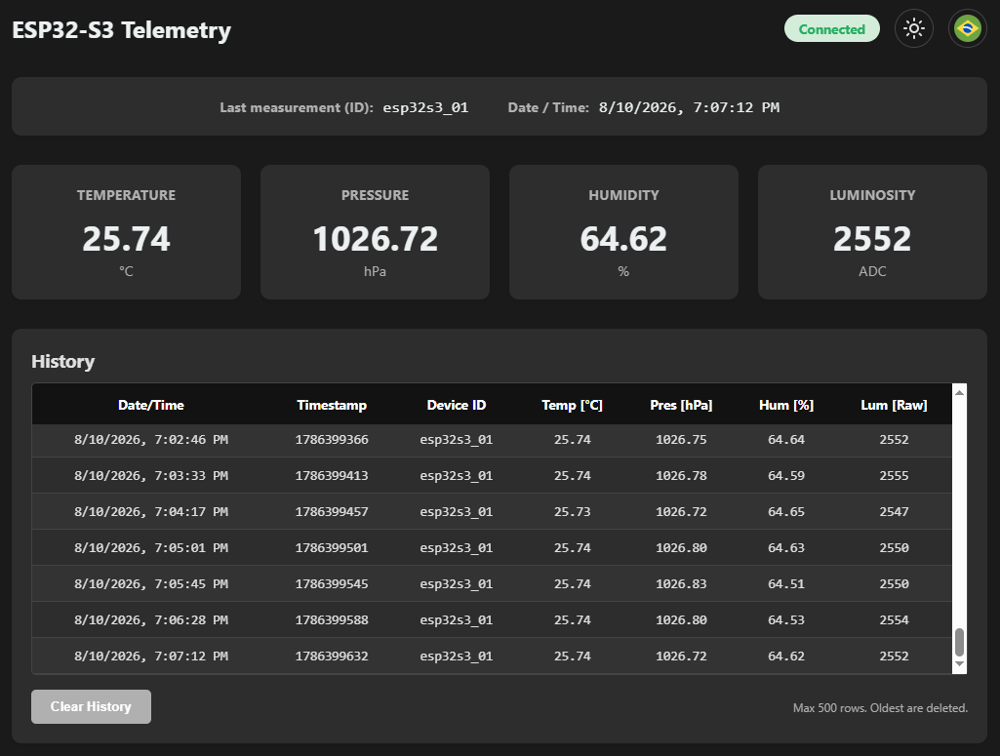
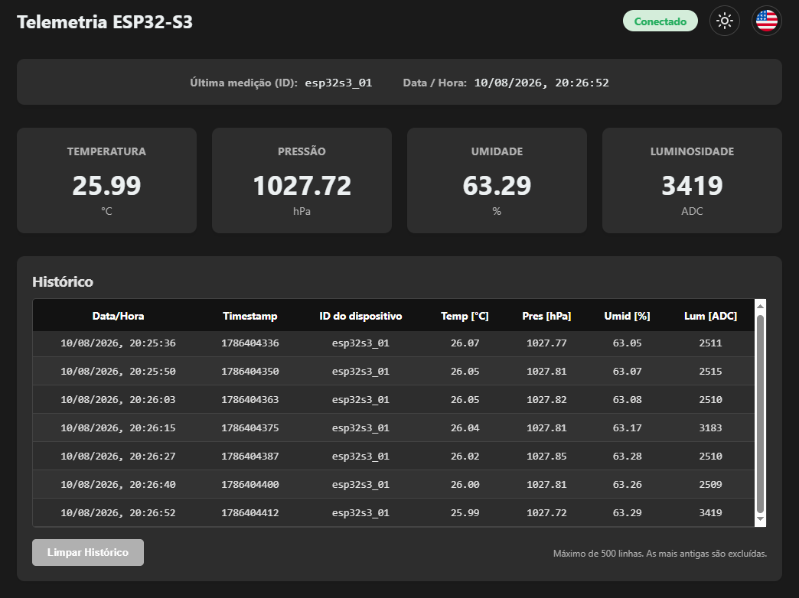

[](https://doi.org/10.5281/zenodo.21894931)

# IoT Field Station (ESP32-S3): Environmental Sensor Readings (Temperature, Pressure, Humidity, and Luminosity)

[English (US)](#english) | [Português (BR)](#português)

---
## English

### 📝 Overview
Modular firmware developed in C (**ESP-IDF**) for the **ESP32-S3 DevKitC-1 N8R2**. The system performs environmental sensor readings, processes data in external memory buffers (PSRAM), and transmits via MQTT. In case of connectivity failure or time synchronization issues, data is persisted in a **LittleFS** partition on Flash.

ESP32-S3 was used as a prototype for testing and project validation. This board is excellent for accelerating development and prototyping. However, the ESP32-S3 DevKitC-1 N8R2 is not the cheapest model in the ESP32 line with Wi-Fi. Other models (such as the **ESP32-C3**) could be evaluated for production as they have a significantly lower purchase cost and higher energy efficiency. For deployment with other models, project modifications and pinout adjustments would be necessary.


#### 🔗 Integration with Virtcon Platform
This project is integrated with the **Virtcon** Platform, an independent system used for data visualization and **anomaly detection**. Virtcon identifies abrupt deviations from normal environmental patterns, adding a layer of intelligent monitoring to the Field Station's telemetry. While Virtcon is in its early development stage, the ESP32-S3 Field Station project is fully operational.
For more details, see [VIRTCON_OVERVIEW](./VIRTCON_OVERVIEW.md).


#### 🌐 Current Network Topology (Local)
Currently, the project operates as a **Private IoT LAN**. It is designed to handle multiple field stations simultaneously:
*   **Nodes (Field Stations)**: One or more ESP32-S3 devices performing One-Shot cycles.
*   **Hub (Broker/Monitor)**: A computer or server running **Mosquitto** and hosting the frontend.
*   **Connectivity**: Communication happens over 2.4GHz Wi-Fi (hardware limitation of the ESP32-S3). All devices must be on the same subnet (sharing the same IP range). 
*   **Constraint Note**: Local traffic must be direct; use of VPNs on the computer might mask the local IP and prevent stations from connecting.

**Technical Note on Architecture**: Unlike a Web Server model (which would require the ESP32-S3 to be permanently powered and connected to handle requests) this station operates as an **MQTT Client**. This allows the device to remain in *Deep Sleep* most of the time, waking up only for a few seconds to transmit data. This approach prevents "Connection Timed Out" errors and ensures that the latest readings are always available on the Broker.

Furthermore, this architecture is optimized for **scalability**. While a single always-on ESP32-S3 might consume less than a PC, this project is designed for deployments with multiple stations. By leveraging an existing server (which typically handles other infrastructure tasks), the marginal power cost of the Broker is negligible, while each field station achieves maximum battery life and data reliability.

#### ☁️ Future Expansion: Cloud Integration
The system is ready to scale beyond the local network. By migrating the Broker to the **Cloud** (e.g., HiveMQ, EMQX, or AWS IoT):
*   **Global Access**: Monitor your field stations from any internet-connected device (4G/5G).
*   **Independence**: No need to keep a local PC powered on 24/7.
*   **Centralization**: Multiple stations in different geographical locations can send data to a single unified telemetry monitor.

---

### 📂 Project Structure

Below are the main directories and files that make up the solution:

- `main/`: Contains the main C source code.
  - `main.c`: One-Shot cycle control logic and task orchestration.
  - `secrets.h`: Automatically generated configuration file (Wi-Fi/MQTT).
  - `*_sensor.c/h`: Modular drivers for BME280 / GY-BME280 and LDR 7mm.
  - `network.c/h` & `telemetry.c/h`: Wi-Fi/MQTT management and JSON data formatting.
  - `storage.c/h`: LittleFS persistence layer implementation.
- `partitions.csv`: Custom flash partition table.
- `sdkconfig.defaults`: Base hardware configuration (PSRAM, Flash, CPU).
- `frontend/`: Web Application (**Telemetry Monitor**) for real-time monitoring.
  - `index.html`, `app.js`, `style.css`: Interface developed in Vanilla JS with MQTT integration.
  - `config.js`: Automatically generated configuration file.
- `mosquitto/`: Configurations for the Mosquitto MQTT Broker.
- `setup.sh` / `setup.ps1`: Automated configuration scripts (Linux/Mac/Windows).
- `setup_config.ini`: User configuration file (Wi-Fi, MQTT, and Deep Sleep interval).

---

### 🛠️ Circuit Description & Technical Design

The system is powered by an external switching power supply of +5V DC / 1A.


#### 🔌 Connection Details (Pinout)

| Component | Sensor Pin | ESP32-S3 Pin | Function / Justification |
| :--- | :--- | :--- | :--- |
| **BME280** | VCC | **3.3V** | Constant power. Enters *Sleep Mode* (0.1uA) via software. |
| | SCL / SDA | **GPIO 9 / 8** | Main I2C bus. |
| | GND | **Negative** | Common power reference. |
| **LDR 7mm** | Terminal 1 | **GPIO 6** | **Power Gating**: The divider is only energized during reading to save power. |
| | Terminal 2 | **GPIO 4** | Analog input (**ADC1_CH3**) connected to the divider's center point. |
| **10kΩ Resistor**| Terminal 1 | **GPIO 4** | Acts as a Pull-down for the LDR. |
| | Terminal 2 | **Negative** | Common power reference. |
| **System** | +5V pin | **Power Output** | Main power from the 5V DC charger. |
| | GND pin | **Negative** | Ground interconnection with the power supply and sensors. |

#### ⚡ Power Supply and Cabling
*   **Adapter (Example)**: Model DSA-5CAA-05 (Switching Adapter).
*   **Specifications**: Input 100-240V AC | Output +5V DC 1A.
*   **Physical Connection**: A USB-A cable was modified (cut end with exposed wires) to inject power directly into the breadboard. Although the project includes a **USB-A to USB-C** cable, it is used exclusively for flashing the firmware due to its short length. The modified cable allows for the reach of the external power source and centralized power distribution.
*   **Power via UART**: The **UART** port of the ESP32-S3 DevKitC-1 accepts 5V power. However, in the final design, direct connection to the pins was chosen.
*   **Battery and Protection**: A battery with integrated under-voltage protection (BMS) could be used. In this case, when the battery reaches the safe limit, the BMS cuts the power and the battery is not damaged. A voltage measurement circuit for the ESP32-S3 could be assembled, but this would increase energy consumption and the number of components.

---

### 🚀 Quick Start Guide

This guide uses an **Interactive CLI** that automates configuration, build, flashing, and service launching.

#### 1. Software Prerequisites
1.  **Visual Studio Code**: [Download here](https://code.visualstudio.com/).
2.  **ESP-IDF Extension**: Install inside VS Code and follow the [Setup Guide](https://docs.espressif.com/projects/esp-idf/en/latest/esp32s3/get-started/index.html).
    *   After installing it, you must perform the basic configuration in the extension: select Port, set Device Target to `esp32s3`, and select the Flash Method.
3.  **Mosquitto MQTT**: [Download here](https://mosquitto.org/download/).
    * If installed as a service, it will start automatically; otherwise, the script will offer to start it.

#### 2. Automatic Configuration & Execution
1.  Open this project folder in **Visual Studio Code**.
2.  Open the **ESP-IDF Terminal**. Press `F1` or `Ctrl + Shift + P` (`Cmd + Shift + P` on macOS) to open the Command Palette. Then type **ESP-IDF: Open ESP-IDF Terminal** and select it.
3.  Run the Script:
    ```shell
    # Windows
    .\setup.ps1
    # If the command above fails, try:
    powershell -ExecutionPolicy Bypass -File .\setup.ps1

    # Linux / Mac
    chmod +x setup.sh && ./setup.sh
    # If the command above fails, try:
    bash setup.sh
    ```
4.  **Follow the instructions on the screen.** The script will:
    - Validate your Wi-Fi and MQTT settings.
    - Generate necessary code files.
    - Ask if you want to **Build & Flash**. Ensure ESP32-S3 is connected via USB. You might need to put it into Download Mode: hold down the BOOT button on the board, quickly press RESET, and then release BOOT. After flashing, you may need to press the RESET button to start the firmware.
    - Ask if you want to launch the **Broker and Telemetry Monitor**.
    *Note: The MQTT Broker must remain running in the background for the system to function. Closing its terminal window will stop data reception.*

<details>
<summary><b>🛠️ Alternative / Manual Setup (Click to expand)</b></summary>

If the automatic script fails:

1.  **Manual Config**: Copy `setup_config.ini.example` to `setup_config.ini` and edit it with your details.
2.  **Generate Files**: Run `.\setup.ps1` (Windows) or `chmod +x setup.sh && ./setup.sh` (Linux / Mac) and select "Continue with current settings" if it asks, or simply run the generation logic.
    ```shell
    # If the command above fails, try:
    # Windows
    powershell -ExecutionPolicy Bypass -File .\setup.ps1
    
    # Linux / Mac
    ./setup.sh
    # or:
    bash setup.sh
    ```
3.  **Build & Flash**:
    - Connect your **ESP32-S3** to the computer via USB. You might need to put it into Download Mode: hold down the BOOT button on the board, quickly press RESET, and then release BOOT. After flashing, you may need to press the RESET button to start the firmware.
    ```bash
    idf.py build flash
    ```
    *Note: the `idf.py` command requires the environment variables to be set. If it fails, you can simply use the ESP-IDF extension icons (Build Project and Flash Device).
4.  **Start Broker**:
    - In a separate terminal window, run:
    ```bash
    mosquitto -c mosquitto/mosquitto.conf -v
    ```
    **Keep this terminal window open.** *Note: If 'mosquitto' is not recognized, use the full path: `& "C:\Program Files\mosquitto\mosquitto.exe" -c mosquitto/mosquitto.conf -v` (on Windows). On Linux/macOS, ensure it is installed via your package manager (`apt` or `brew`).*
5.  **Open Telemetry Monitor**:
    - In a new VS Code terminal tab, launch the monitor:
    ```bash
    # Windows
    .\frontend\index.html

    # macOS
    open frontend/index.html

    # Linux
    xdg-open frontend/index.html
    ```
  *Note: The broker must be running for the telemetry monitor to receive data. Closing the terminal stops the broker.*
</details>



---

### 🧠 Technologies and Resources Used

- **ESP-IDF v5.x**: Professional framework for native C development.
- **PSRAM (SPIRAM)**: Use of 2MB external RAM for JSON buffer allocation. Using external RAM prevents fragmentation of the internal heap and allows handling larger payloads or backup queues without compromising the main application memory.
- **LittleFS**: Power-failure resilient file system for local telemetry storage.
- **One-Shot Architecture**: Linear life cycle (Wake up -> Measure -> Transmit -> Sleep). The interval can be customized in `setup_config.ini` (default: 5 min).
  - *Radio Time & Connectivity*: The Wi-Fi connection timeout is hardcoded to 10 seconds (100 retries of 100ms) in `main/network.c` to prevent excessive battery drain if the signal is lost. For further optimization, implementing a Static IP (instead of DHCP) could save ~2 seconds of radio time.
  - *Safety Note*: The absolute technical minimum for ESP32-S3 deep sleep is on the order of milliseconds, but for application stability and power efficiency, at least 10 seconds is recommended.
- **NTP/SNTP Sync**: Strict synchronization. The system validates real time before persisting or sending data to ensure chronology.
- **Silent Production**: Firmware optimized for production.

---
## Português

### 📝 Visão Geral
Firmware modular desenvolvido em C (**ESP-IDF**) para o **ESP32-S3 DevKitC-1 N8R2**. O sistema realiza a leitura de sensores ambientais, processa os dados em buffers de memória externa (PSRAM) e transmite via MQTT. Em caso de falha de conectividade ou sincronismo de tempo, os dados são persistidos em uma partição **LittleFS** na Flash.

O ESP32-S3 foi usado como protótipo para testes e validação do projeto. Esta placa é excelente para acelerar a criação e prototipagem. No entanto, o ESP32-S3 DevKitC-1 N8R2 não é o modelo mais barato da linha ESP32 que possui Wi-Fi. Outros modelos (como o **ESP32-C3**) poderiam ser avaliados para produção por terem um custo de compra bem menor e maior eficiência energética. Para implementação com outros modelos, seriam necessárias modificações no projeto e ajustes de pinagem.


#### 🔗 Integração com a Plataforma Virtcon
Este projeto possui integração com a Plataforma **Virtcon**, um sistema independente utilizado para visualização de dados e **detecção de anomalias**. O Virtcon identifica desvios abruptos nos padrões climáticos normais, adicionando uma camada de monitoramento inteligente à telemetria da Field Station. Enquanto o Virtcon está em fase inicial de desenvolvimento, o projeto ESP32-S3 Field Station já está totalmente operacional.
Para mais detalhes, consulte o arquivo [VIRTCON_OVERVIEW](./VIRTCON_OVERVIEW.md).


#### 🌐 Topologia de Rede Atual (Local)
Atualmente, o projeto opera como uma **LAN IoT Privada**. Ele foi projetado para gerenciar múltiplas estações de campo simultaneamente:
*   **Nós (Estações)**: Um ou mais dispositivos ESP32-S3 realizando ciclos One-Shot.
*   **Hub (Broker/Monitor)**: Um computador ou servidor executando o **Mosquitto** e servindo o frontend.
*   **Conectividade**: A comunicação ocorre via Wi-Fi 2.4GHz (limitação de hardware do ESP32-S3). Todos os dispositivos devem estar na mesma sub-rede (mesmo range de IP).
*   **Nota de Restrição**: O tráfego local deve ser direto; o uso de VPNs no computador pode mascarar o IP local e impedir que as estações se conectem.

**Nota Técnica sobre a Arquitetura**: Diferente de um modelo de Servidor Web — que exigiria que o ESP32-S3 permanecesse ligado e conectado permanentemente para responder a requisições — esta estação opera como um **Cliente MQTT**. Isso permite que o dispositivo permaneça em *Deep Sleep* a maior parte do tempo, acordando apenas por alguns segundos para transmitir os dados. Essa abordagem evita erros de "Tempo de Conexão Esgotado" e garante que as leituras estejam sempre disponíveis no Broker.

Além disso, essa arquitetura é otimizada para **escalabilidade**. Embora um único ESP32-S3 sempre ligado possa parecer consumir menos que um PC, este projeto foi concebido para implantações com múltiplas estações. Ao aproveitar um servidor já existente (que geralmente já executa outros serviços de infraestrutura), o custo marginal de energia do Broker é insignificante, enquanto cada estação de campo atinge a máxima vida útil da bateria e confiabilidade de dados.

#### ☁️ Expansão Futura: Integração com a Nuvem
O sistema está pronto para escalar além da rede local. Ao migrar o Broker para a **Nuvem** (ex: HiveMQ, EMQX ou AWS IoT):
*   **Acesso Global**: Monitore suas estações de campo de qualquer dispositivo com internet (4G/5G).
*   **Independência**: Elimina a necessidade de manter um PC local ligado 24/7.
*   **Centralização**: Estações em diferentes localizações geográficas podem reportar para um único monitor de telemetria unificado.

---

### 📂 Estrutura do Projeto

Abaixo, os principais diretórios e arquivos que compõem a solução:

- `main/`: Contém o código-fonte principal em C.
  - `main.c`: Lógica de controle do ciclo One-Shot e orquestração de tarefas.
  - `secrets.h`: Arquivo de configuração gerado automaticamente (Wi-Fi/MQTT).
  - `*_sensor.c/h`: Drivers modulares para BME280 / GY-BME280 e LDR 7mm.
  - `network.c/h` & `telemetry.c/h`: Gestão de Wi-Fi/MQTT e formatação de dados JSON.
  - `storage.c/h`: Implementação da camada de persistência LittleFS.
- `partitions.csv`: Tabela de partições customizada.
- `sdkconfig.defaults`: Configurações base de hardware (PSRAM, Flash, CPU).
- `frontend/`: Aplicação Web (**Monitor de Telemetria**) para monitoramento em tempo real.
  - `index.html`, `app.js`, `style.css`: Interface em Vanilla JS com integração MQTT.
  - `config.js`: Arquivo de configuração gerado automaticamente.
- `mosquitto/`: Configurações para o Broker MQTT Mosquitto.
- `setup.sh` / `setup.ps1`: Scripts de configuração automática (Linux/Mac/Windows).
- `setup_config.ini`: Arquivo de configurações do usuário (Wi-Fi, MQTT e intervalo de Deep Sleep).

---

### 🛠️ Descrição do Circuito

O sistema é alimentado por uma fonte externa chaveada de +5V DC / 1A.


#### 🔌 Detalhamento de Conexões (Pinagem)

| Componente            | Pino Sensor | Pino ESP32-S3 | Função / Justificativa |
|:----------------------| :--- | :--- | :--- |
| **BME280**            | VCC | **3.3V** | Alimentação constante. Entra em *Sleep Mode* (0.1uA) via software. |
|                       | SCL / SDA | **GPIO 9 / 8** | Barramento I2C principal. |
|                       | GND | **Negativo** | Referência comum de energia. |
| **LDR 7mm**           | Terminal 1 | **GPIO 6** | **Power Gating**: O divisor só é energizado durante a leitura para economizar energia. |
|                       | Terminal 2 | **GPIO 4** | Entrada analógica (**ADC1_CH3**) conectada ao ponto central do divisor. |
| **Resistor 10kΩ**     | Terminal 1 | **GPIO 4** | Atua como Pull-down para o LDR. |
|                       | Terminal 2 | **Negativo** | Referência comum de energia. |
| **Sistema**           | pino +5V | **Saída Fonte** | Alimentação principal vinda do carregador 5V DC. |
|                       | pino GND | **Negativo** | Interconexão de massa com a fonte e sensores. |

#### ⚡ Fonte de Alimentação e Cabeamento
*   **Adaptador (Exemplo)**: Modelo DSA-5CAA-05 (Switching Adapter).
*   **Especificações**: Input 100-240V AC | Output +5V DC 1A.
*   **Conexão Física**: Um cabo USB-A foi modificado (extremidade cortada com fios expostos) para injetar a alimentação diretamente na protoboard. Embora o projeto conte com um cabo **USB-A para USB-C**, este é utilizado exclusivamente para gravação do firmware devido ao seu comprimento reduzido. O cabo modificado permite o alcance da fonte externa e a distribuição centralizada de energia.
*   **Alimentação via UART**: A porta **UART** do ESP32-S3 DevKitC-1 aceita alimentação de 5V. No entanto, no design final, optou-se pela conexão direta nos pinos.
*   **Bateria e Proteção**: Uma bateria com proteção integrada contra subtensão (BMS) poderia ser usada. Nesse caso, quando a bateria atinge o limite seguro, o BMS corta a energia e a bateria não é danificada. Um circuito para medição de tensão pelo ESP32-S3 poderia ser montado, mas isso aumentaria o consumo de energia e o número de componentes.

---

### 🚀 Guia de Início Rápido

Este guia utiliza uma **CLI Interativa** que automatiza a configuração, compilação, gravação e execução dos serviços.

#### 1. Pré-requisitos de Software
1.  **Visual Studio Code**: [Baixe aqui](https://code.visualstudio.com/).
2.  **Extensão ESP-IDF**: Instale no VS Code e siga o [Guia de Instalação](https://docs.espressif.com/projects/esp-idf/en/latest/esp32s3/get-started/index.html).
    *   Após instalar, você deve realizar a configuração básica na extensão: selecionar Porta, definir Device Target para `esp32s3` e selecionar o Método de Gravação.
3.  **Mosquitto MQTT**: [Baixe aqui](https://mosquitto.org/download/). (Se instalado como serviço, ele iniciará automaticamente; caso contrário, o script oferecerá para iniciá-lo).

#### 2. Configuração e Execução Automática
1.  Abra a pasta deste projeto no **Visual Studio Code**.
2.  Abra o **Terminal do ESP-IDF**. Pressione `F1` ou `Ctrl + Shift + P` (`Cmd + Shift + P` no macOS) para abrir a Paleta de Comandos. Em seguida, digite **ESP-IDF: Open ESP-IDF Terminal** e selecione-o.
3.  Execute o Script:
    ```shell
    # Windows
    .\setup.ps1
    # ou:
    powershell -ExecutionPolicy Bypass -File .\setup.ps1

    # Linux / Mac
    chmod +x setup.sh && ./setup.sh
    # ou:
    bash setup.sh
    ```
4.  **Siga as instruções na tela.** O script irá:
    - Validar suas configurações de Wi-Fi e MQTT.
    - Gerar os arquivos de código necessários.
    - Perguntar se deseja **Compilar e Gravar**. Certifique-se de que o ESP32-S3 está conectado via USB. Pode ser necessário colocá-lo em Modo de Gravação manualmente: mantenha o botão BOOT pressionado, pressione rapidamente o RESET e então solte o BOOT. Após a gravação, pode ser necessário pressionar o RESET para iniciar o firmware.
    - Perguntar se deseja iniciar o **Broker e o Monitor de Telemetria**.
    *Nota: O Broker MQTT deve permanecer em execução em segundo plano para que o sistema funcione. Fechar a janela do terminal do broker interromperá a recepção de dados.*

<details>
<summary><b>🛠️ Configuração Alternativa / Manual (Clique para expandir)</b></summary>

Caso o script automático falhe:

1.  **Configuração Manual**: Copie `setup_config.ini.example` para `setup_config.ini` e edite com seus dados.
2.  **Gerar Arquivos**: Execute `.\setup.ps1` (Windows) ou `chmod +x setup.sh && ./setup.sh` (Linux / Mac) e selecione "Continuar com as configurações atuais" ou apenas execute a lógica de geração.
    ```shell
    # Se o comando acima falhar, use:
    # Windows (Terminal/PowerShell)
    powershell -ExecutionPolicy Bypass -File .\setup.ps1
    
    # Linux / Mac
    ./setup.sh
    # ou:
    bash setup.sh
    ```
3.  **Compilar e Gravar**:
    - Conecte o microcontrolador no computador via USB. Pode ser necessário colocá-lo em Modo de Gravação manualmente: mantenha o botão BOOT pressionado, pressione rapidamente o RESET e então solte o BOOT. Após a gravação, pode ser necessário pressionar o RESET para iniciar o firmware.
    ```bash
    idf.py build flash
    ```
    *Nota: O comando `idf.py` exige que as variáveis de ambiente estejam configuradas. Se ele falhar, você pode simplesmente usar os ícones da extensão ESP-IDF (Build e Flash).
4.  **Iniciar Broker**:
    - Em uma janela de terminal separada, execute:
    ```bash
    mosquitto -c mosquitto/mosquitto.conf -v
    ```
    **Mantenha essa janela aberta.** *Nota: Se 'mosquitto' não for reconhecido, use o caminho completo `& "C:\Program Files\mosquitto\mosquitto.exe" -c mosquitto/mosquitto.conf -v` (Windows). No Linux/macOS, certifique-se de instalá-lo pelo gerenciador de pacotes (`apt` or `brew`).*
5.  **Abrir Monitor de Telemetria**:
    - Em uma nova janela de terminal, execute:
    ```bash
    # Windows
    .\frontend\index.html

    # macOS
    open frontend/index.html

    # Linux
    xdg-open frontend/index.html
    ```
    *Nota: o Broker deve estar em execução para que o monitor de telemetria receba dados. Fechar a janela do terminal do Broker interrompe a recepção.
</details>



---

### 🧠 Tecnologias e Recursos Utilizados

- **ESP-IDF v5.x**: Framework profissional para desenvolvimento nativo em C.
- **PSRAM (SPIRAM)**: Uso de 2MB de RAM externa para alocação de buffers JSON. O uso da RAM externa evita a fragmentação do heap interno e permite manipular payloads maiores ou filas de backup sem comprometer a memória principal da aplicação.
- **LittleFS**: Sistema de arquivos resiliente a falhas de energia para armazenamento local de telemetria.
- **One-Shot Architecture**: Ciclo de vida linear (Acordar -> Medir -> Transmitir -> Dormir). O intervalo pode ser personalizado no arquivo `setup_config.ini` (padrão: 5 min).
  - *Tempo de Rádio e Conectividade*: O timeout da conexão Wi-Fi está codificado para 10 segundos (100 tentativas de 100ms) em `main/network.c` para evitar drenagem excessiva da bateria caso o sinal falhe. Para otimização futura, a implementação de IP Estático (em vez de DHCP) pode economizar ~2 segundos de tempo de rádio.
  - *Nota de Segurança*: O mínimo técnico para o deep sleep do ESP32-S3 é da ordem de milissegundos, mas para estabilidade da aplicação e eficiência energética, recomenda-se pelo menos 10 segundos.
- **NTP/SNTP Sync**: Sincronização estrita. O sistema valida o tempo real antes de persistir ou enviar dados para garantir a cronologia.
- **Produção Silenciosa**: Firmware otimizado para produção.

---
