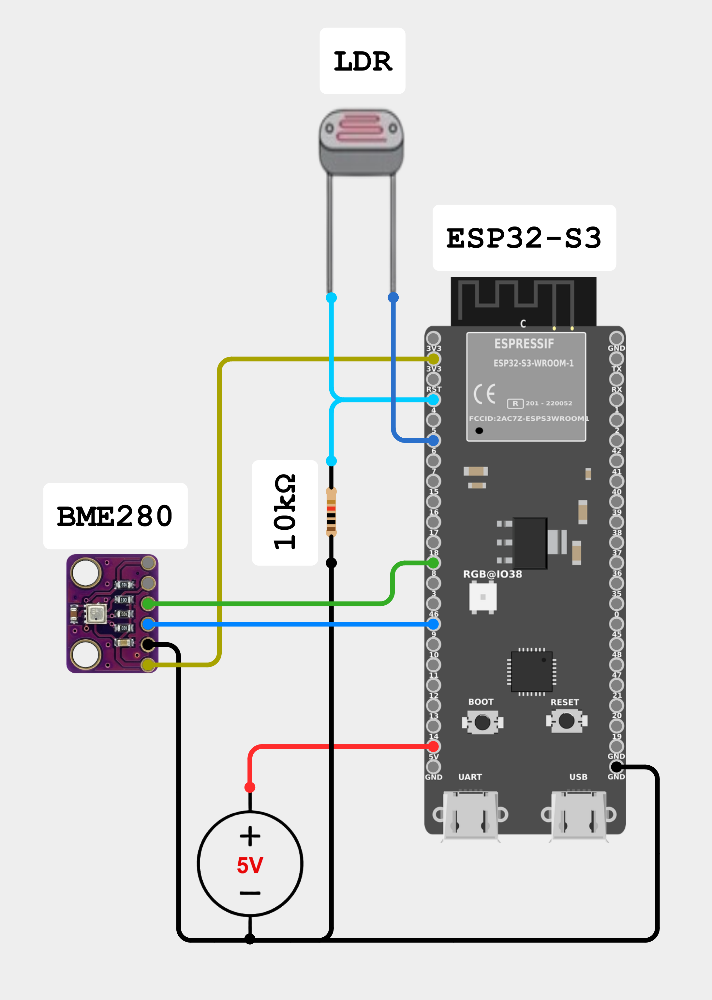

# ESP32-S3 Field Station

[English (US)](#english) | [Português (BR)](#português)

---
## English

### 📝 Overview
Modular firmware developed in C (**ESP-IDF**) for the **ESP32-S3 DevKitC-1 N8R2**. The system performs environmental sensor readings, processes data in external memory buffers (PSRAM), and transmits via MQTT. In case of connectivity failure or time synchronization issues, data is persisted in a **LittleFS** partition on Flash.

The station was designed for field operation, prioritizing data integrity and minimum power consumption through a "One-Shot" architecture.

---

### 📂 Project Structure

Below are the main directories and files that make up the solution:

- `main/`: Contains the main C source code.
  - `main.c`: One-Shot cycle control logic and task orchestration.
  - `*_sensor.c/h`: Modular drivers for BME280 / GY-BME280 and LDR 7mm.
  - `network.c/h` & `telemetry.c/h`: Wi-Fi/MQTT management and JSON data formatting.
  - `storage.c/h`: LittleFS persistence layer implementation.
- `partitions.csv`: Custom flash partition table.
- `sdkconfig.defaults`: Base hardware configuration (PSRAM, Flash, CPU).
- `frontend/`: Web Application (Dashboard) for real-time monitoring.
  - `index.html`, `app.js`, `style.css`: Interface developed in Vanilla JS with MQTT integration.
- `mosquitto/`: Configurations for the Mosquitto MQTT Broker.
- `setup.sh` / `setup.ps1`: Automated configuration scripts (Linux/Mac/Windows).
- `setup_config.ini`: User configuration file (Wi-Fi, MQTT, and Deep Sleep interval).

---

### 🛠️ Circuit Description & Technical Design

The system is powered by an external switching power supply of +5V DC / 1A.



#### 🔌 Connection Details (Pinout)

| Component | Sensor Pin | ESP32-S3 Pin | Function / Justification |
| :--- | :--- | :--- | :--- |
| **BME280** | VCC | **3.3V** | Constant power. Enters *Sleep Mode* (0.1uA) via software. |
| | SCL / SDA | **GPIO 9 / 8** | Main I2C bus. |
| | GND | **Negative** | Common power reference. |
| **LDR 7mm** | Terminal 1 | **GPIO 6** | **Power Gating**: The divider is only energized during reading to save power. |
| | Terminal 2 | **GPIO 4** | Analog input (**ADC1_CH3**) connected to the divider's center point. |
| **10kΩ Resistor**| Terminal 1 | **GPIO 4** | Acts as a Pull-down for the LDR. |
| | Terminal 2 | **Negative** | Common power reference. |
| **System** | +5V pin | **Power Output** | Main power from the 5V DC charger. |
| | GND pin | **Negative** | Ground interconnection with the power supply and sensors. |

#### ⚡ Power Supply and Cabling
*   **Adapter (Example)**: Model DSA-5CAA-05 (Switching Adapter).
*   **Specifications**: Input 100-240V AC | Output +5V DC 1A.
*   **Physical Connection**: A USB-A cable was modified (cut end with exposed wires) to inject power directly into the breadboard. Although the project includes a **USB-A to USB-C** cable, it is used exclusively for flashing the firmware due to its short length. The modified cable allows for the reach of the external power source and centralized power distribution.
*   **Power via UART**: The **UART** port of the ESP32-S3 DevKitC-1 accepts 5V power. However, in the final design, direct connection to the pins was chosen.

---

### 🚀 Quick Start Guide (User Manual)

#### 1. Software Prerequisites

1.  **Visual Studio Code**: [Download here](https://code.visualstudio.com/).
2.  **ESP-IDF Extension/SDK**: [Official Setup Guide](https://docs.espressif.com/projects/esp-idf/en/latest/esp32s3/get-started/index.html).
3.  **Eclipse Mosquitto**: [Download here](https://mosquitto.org/download/). Required for the MQTT Broker. **Do not install as a service** if you want it to run only when needed.
4.  **Git (Optional)**: [Download here](https://git-scm.com/). Used to clone the project via terminal. If you don't have it installed, the easiest way is to download the project directly from the GitHub interface.

#### 2. Fast Setup

*Note: Cloning can be performed using terminal, or directly via GitHub Web (Download ZIP).*

1.  **Clone / Download**: 
     - **Option A (ZIP)**: Download and **extract (unzip)** the ZIP file. Open the extracted folder in VS Code. *Note: GitHub creates a nested folder (e.g., `Field-Station-ESP32-S3-main`). Ensure you open the root folder that contains the `main/` directory.*
     - **Option B (Git)**: Open **Visual Studio Code**, open the internal terminal (Ctrl+Shift+`), and run:
      ```bash
      cd /path/to/your/folder
      git clone https://github.com/morustree/Field-Station-ESP32-S3.git
      cd Field-Station-ESP32-S3
      ```
2.  **Run Setup**: Run the appropriate script for your OS in the VS Code terminal:
    ```bash
    # For Windows
    .\setup.ps1
    # If the command above fails due to security restrictions, use:
    powershell -ExecutionPolicy Bypass -File .\setup.ps1

    # For Linux / Mac
    chmod +x setup.sh && ./setup.sh
    # If the command above fails, try:
    bash setup.sh
    ```
    *The script will create your `setup_config.ini` file and open it for editing. Fill in your details (keep the quotation marks ""), **save, and close the file** to finish the setup.*
3.  **Build project and Flash Device**: 
    - Connect your **ESP32-S3** to the computer via USB.
    - If the device is not detected, put it into **Download Mode**: hold the **BOOT** button, press **RESET**, and then release **BOOT**.
    - In the ESP-IDF terminal, run:
    ```bash
    idf.py build flash
    ```
    *Note: The `idf.py` command requires the environment variables to be set. If using **VS Code**, you can simply use the ESP-IDF extension icons (Build Project and Flash Device). You may need to perform basic configuration in the extension first (Select Port, Set Device Target to `esp32s3`, and Select Flash Method). After flashing, you may need to press the **RESET** button on the board to start the firmware.*
4.  **Dashboard**: 
    - **Step 1**: Start the MQTT Broker. In a separate terminal window, run:
      ```bash
      mosquitto -c mosquitto/mosquitto.conf -v
      ```
      **Keep this terminal window open.** *Note: If 'mosquitto' is not recognized, use the full path: `& "C:\Program Files\mosquitto\mosquitto.exe" -c mosquitto/mosquitto.conf -v` (on Windows). On Linux/macOS, ensure it is installed via your package manager (`apt` or `brew`).*
    - **Step 2**: In a new VS Code terminal tab, launch the dashboard:
      ```bash
      # Windows
      .\frontend\index.html

      # macOS
      open frontend/index.html

      # Linux
      xdg-open frontend/index.html
      ```
    *Note: The broker must be running for the dashboard to receive data. Closing the terminal stops the broker.*


---

### 🧠 Technologies and Resources Used

- **ESP-IDF v5.x**: Professional framework for native C development.
- **PSRAM (SPIRAM)**: Use of 2MB external RAM for JSON buffer allocation.
- **LittleFS**: Power-failure resilient file system for local telemetry storage.
- **One-Shot Architecture**: Linear life cycle (Wake up -> Measure -> Transmit -> Sleep). The interval can be customized in `setup_config.ini` (default: 5 min).
  - *Safety Note*: The absolute technical minimum for ESP32-S3 deep sleep is on the order of milliseconds, but for application stability and power efficiency, at least 10 seconds is recommended.
- **NTP/SNTP Sync**: Strict synchronization. The system validates real time before persisting or sending data to ensure chronology.
- **Silent Production**: Firmware optimized for production.

---
## Português

### 📝 Visão Geral
Firmware modular desenvolvido em C (**ESP-IDF**) para o **ESP32-S3 DevKitC-1 N8R2**. O sistema realiza a leitura de sensores ambientais, processa os dados em buffers de memória externa (PSRAM) e transmite via MQTT. Em caso de falha de conectividade ou sincronismo de tempo, os dados são persistidos em uma partição **LittleFS** na Flash.

A estação foi projetada para operação em campo, priorizando a integridade dos dados e o consumo mínimo de energia por meio de uma arquitetura "One-Shot".

---

### 📂 Estrutura do Projeto

Abaixo, os principais diretórios e arquivos que compõem a solução:

- `main/`: Contém o código-fonte principal em C.
  - `main.c`: Lógica de controle do ciclo One-Shot e orquestração de tarefas.
  - `*_sensor.c/h`: Drivers modulares para BME280 / GY-BME280 e LDR 7mm.
  - `network.c/h` & `telemetry.c/h`: Gestão de Wi-Fi/MQTT e formatação de dados JSON.
  - `storage.c/h`: Implementação da camada de persistência LittleFS.
- `partitions.csv`: Tabela de partições customizada.
- `sdkconfig.defaults`: Configurações base de hardware (PSRAM, Flash, CPU).
- `frontend/`: Aplicação Web (Dashboard) para monitoramento em tempo real.
  - `index.html`, `app.js`, `style.css`: Interface em Vanilla JS com integração MQTT.
- `mosquitto/`: Configurações para o Broker MQTT Mosquitto.
- `setup.sh` / `setup.ps1`: Scripts de configuração automática (Linux/Mac/Windows).
- `setup_config.ini`: Arquivo de configurações do usuário (Wi-Fi, MQTT e intervalo de Deep Sleep).

---

### 🛠️ Descrição do Circuito

O sistema é alimentado por uma fonte externa chaveada de +5V DC / 1A.


#### 🔌 Detalhamento de Conexões (Pinagem)

| Componente            | Pino Sensor | Pino ESP32-S3 | Função / Justificativa |
|:----------------------| :--- | :--- | :--- |
| **BME280**            | VCC | **3.3V** | Alimentação constante. Entra em *Sleep Mode* (0.1uA) via software. |
|                       | SCL / SDA | **GPIO 9 / 8** | Barramento I2C principal. |
|                       | GND | **Negativo** | Referência comum de energia. |
| **LDR 7mm**           | Terminal 1 | **GPIO 6** | **Power Gating**: O divisor só é energizado durante a leitura para economizar energia. |
|                       | Terminal 2 | **GPIO 4** | Entrada analógica (**ADC1_CH3**) conectada ao ponto central do divisor. |
| **Resistor 10kΩ**     | Terminal 1 | **GPIO 4** | Atua como Pull-down para o LDR. |
|                       | Terminal 2 | **Negativo** | Referência comum de energia. |
| **Sistema**           | pino +5V | **Saída Fonte** | Alimentação principal vinda do carregador 5V DC. |
|                       | pino GND | **Negativo** | Interconexão de massa com a fonte e sensores. |

#### ⚡ Fonte de Alimentação e Cabeamento
*   **Adaptador (Exemplo)**: Modelo DSA-5CAA-05 (Switching Adapter).
*   **Especificações**: Input 100-240V AC | Output +5V DC 1A.
*   **Conexão Física**: Um cabo USB-A foi modificado (extremidade cortada com fios expostos) para injetar a alimentação diretamente na protoboard. Embora o projeto conte com um cabo **USB-A para USB-C**, este é utilizado exclusivamente para gravação do firmware devido ao seu comprimento reduzido. O cabo modificado permite o alcance da fonte externa e a distribuição centralizada de energia.
*   **Alimentação via UART**: A porta **UART** do ESP32-S3 DevKitC-1 aceita alimentação de 5V. No entanto, no design final, optou-se pela conexão direta nos pinos.

---

### 🚀 Guia de Início Rápido (Manual de Uso)

#### 1. Pré-requisitos de Software

1.  **Visual Studio Code**: [Baixe aqui](https://code.visualstudio.com/).
2.  **Extensão/SDK ESP-IDF**: [Guia Oficial de Instalação](https://docs.espressif.com/projects/esp-idf/en/latest/esp32s3/get-started/index.html).
3.  **Eclipse Mosquitto**: [Baixe aqui](https://mosquitto.org/download/). Necessário para o Broker MQTT. **Não instale como serviço** se preferir que ele execute apenas quando você desejar.
4.  **Git (Opcional)**: [Baixe aqui](https://git-scm.com/). Usado para clonar o projeto via terminal. Caso não o tenha instalado, o caminho mais fácil é baixar o projeto diretamente pela interface do GitHub.

#### 2. Configuração Rápida

*Nota: A clonagem pode ser feita via terminal ou diretamente pelo GitHub Web (Download ZIP).*

1.  **Clonar / Baixar**: 
  - **Opção A (ZIP)**: Baixe e **extraia (descompacte)** o arquivo ZIP. Abra a pasta extraída no VS Code. *Nota: O GitHub cria uma pasta aninhada (ex: `Field-Station-ESP32-S3-main`). Certifique-se de abrir a pasta raiz que contém o diretório `main/`.*
  - **Opção B (Git)**: Abra o **Visual Studio Code**, abra o terminal interno (Ctrl+Shift+`) e execute:
    ```bash
    cd /caminho/para/sua/pasta
    git clone https://github.com/morustree/Field-Station-ESP32-S3.git
    cd Field-Station-ESP32-S3
    ```
2.  **Executar Setup**: Execute o script apropriado para o seu sistema operacional no terminal do VS Code:
    ```bash
    # Para Windows
    .\setup.ps1
    # Caso o comando acima falhe por restrição de segurança, use:
    powershell -ExecutionPolicy Bypass -File .\setup.ps1

    # Para Linux / Mac
    chmod +x setup.sh && ./setup.sh
    # Caso o comando acima falhe, tente:
    bash setup.sh
    ```
    *O script criará o arquivo `setup_config.ini` e o abrirá para edição. Preencha seus dados (mantenha as aspas ""), **salve e feche o arquivo** para concluir a configuração.*
3.  **Compilar e Gravar**: 
    - Conecte seu **ESP32-S3** ao computador via USB.
    - Caso o dispositivo não seja reconhecido, coloque-o em **Modo de Gravação**: segure o botão **BOOT**, pressione **RESET** e solte o **BOOT**.
    - No terminal do ESP-IDF, execute:
    ```bash
    idf.py build flash
    ```
    *Nota: O comando `idf.py` exige que as variáveis de ambiente estejam configuradas. Se estiver usando o **VS Code**, você pode simplesmente usar os ícones da extensão ESP-IDF (Build e Flash). Pode ser necessário realizar as configurações básicas na extensão antes (Selecionar Porta, Definir Target como `esp32s3` e Selecionar Método de Gravação). Após o término da gravação, você deve pressionar o botão **RESET** físico na placa para iniciar o firmware.*
4.  **Dashboard**: 
    - **Passo 1**: Inicie o Broker MQTT. Em uma janela de terminal à parte, execute:
      ```bash
      mosquitto -c mosquitto/mosquitto.conf -v
      ```
      **Mantenha esta janela do terminal aberta.** *Nota: Caso 'mosquitto' não seja reconhecido, use o caminho completo: `& "C:\Program Files\mosquitto\mosquitto.exe" -c mosquitto/mosquitto.conf -v` (no Windows). No Linux/macOS, verifique se foi instalado via gerenciador de pacotes (`apt` ou `brew`).*
    - **Passo 2**: Em uma nova aba de terminal do VS Code, abra o dashboard:
      ```bash
      # Windows
      .\frontend\index.html

      # macOS
      open frontend/index.html

      # Linux
      xdg-open frontend/index.html
      ```
    *Nota: O broker precisa estar rodando para que o dashboard receba os dados. Fechar o terminal encerra o broker.*


---

### 🧠 Tecnologias e Recursos Utilizados

- **ESP-IDF v5.x**: Framework profissional para desenvolvimento nativo em C.
- **PSRAM (SPIRAM)**: Uso de 2MB de RAM externa para alocação de buffers JSON.
- **LittleFS**: Sistema de arquivos resiliente a falhas de energia para armazenamento local de telemetria.
- **One-Shot Architecture**: Ciclo de vida linear (Acordar -> Medir -> Transmitir -> Dormir). O intervalo pode ser personalizado no arquivo `setup_config.ini` (padrão: 5 min).
  - *Nota de Segurança*: O mínimo técnico para o deep sleep do ESP32-S3 é da ordem de milissegundos, mas para estabilidade da aplicação e eficiência energética, recomenda-se pelo menos 10 segundos.
- **NTP/SNTP Sync**: Sincronização estrita. O sistema valida o tempo real antes de persistir ou enviar dados para garantir a cronologia.
- **Produção Silenciosa**: Firmware otimizado para produção.

---
