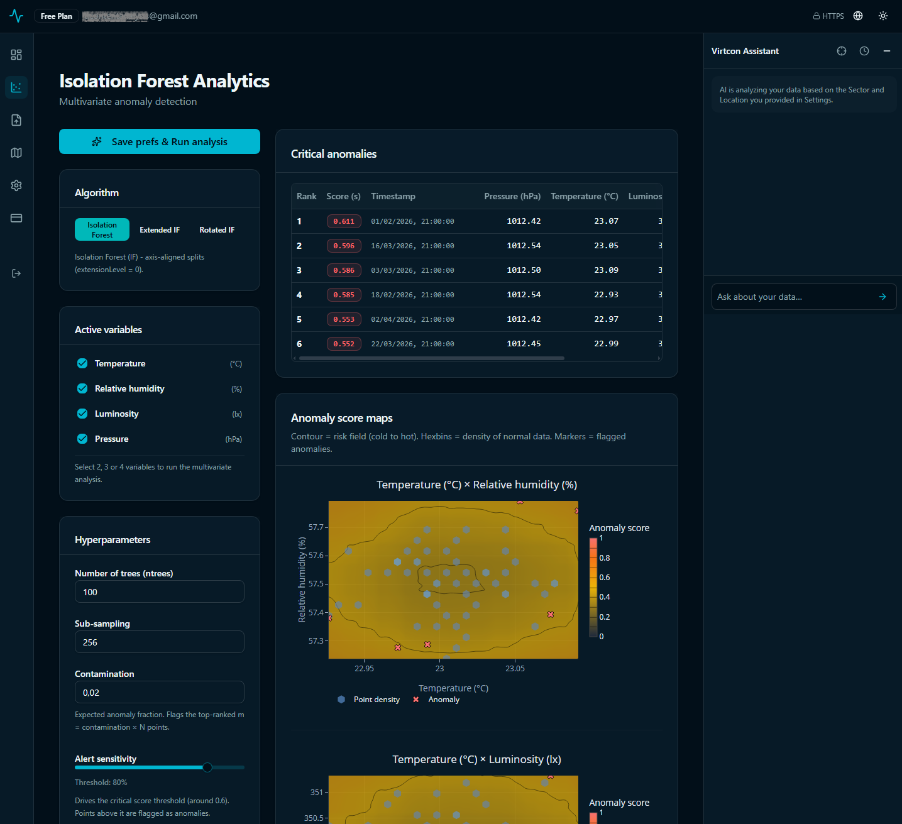
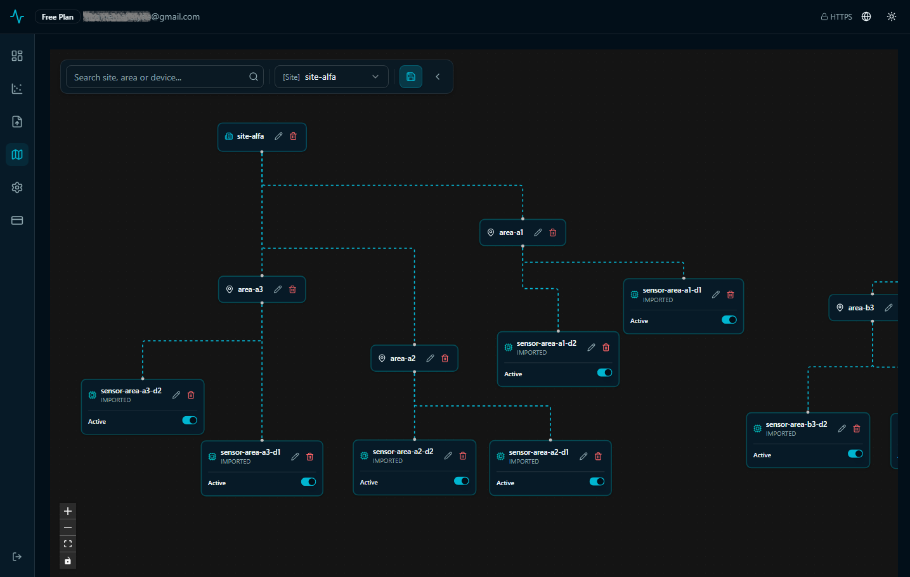

# Virtcon: Monitoring and Anomaly Detection Platform

[English (US)](#english) | [Português (BR)](#português)

---
## English

This document consolidates the technical and functional information of the **Virtcon** system.

## 1. Overview (Multi-tenant SaaS)

**Virtcon** is a multi-tenant SaaS (Software as a Service) platform designed for monitoring and anomaly detection in various scenarios. The system combines agnostic IoT data ingestion, advanced statistical models, and generative artificial intelligence to transform raw sensor data into diagnoses. The platform is **metric-agnostic**, allowing the monitoring of any set of up to 4 simultaneous variables.

### Architecture and Technology Stack
*   **Backend:** Kotlin 2.3.21, Spring Boot 4.1.0, and Java 25. Asynchronous processing for data analysis and LLM integration via WebFlux.
*   **Frontend:** React 19.2 with TanStack Start (SSR via Nitro), TypeScript 5.8, and Tailwind CSS 4.
*   **Infrastructure:** PostgreSQL 16 (metadata), InfluxDB 2.7 (time series), Redis 7 (cache and chat history), and Mosquitto 2.0 (MQTT Broker).
*   **Security:** Multi-tenant isolation via Hibernate Filters and AOP. JWT authentication via HttpOnly Secure cookies.

---

## 2. Intelligent Diagnostic Layer

**Google Gemini** can transform multivariate anomaly scores and telemetry metadata into insights, identifying subtle correlations between physical variables and anomalous behaviors. Through grounding techniques, the AI contextualizes the monitored physical variables with the economic activity and site location, facilitating technical decision-making through a conversational interface. 

Among the models in the Gemini family, the Gemini Pro version was identified as the most suitable, as it offers a superior capacity for advanced statistical reasoning. 

### Theoretical Foundation and Architecture Inspired by DS-STAR

The capacity of language models to perform structured analyses and rigorous diagnostics is grounded in research from Google Research, such as the **[DS-STAR](https://research.google/pubs/ds-star-data-science-agent-via-iterative-planning-and-verification/)** (a data science agent that automates statistical analyses). Google's study demonstrates that DS-STAR's iterative architecture drastically increases accuracy in table analysis (CSV, JSON) and time series, as the agent prevents numerical hallucinations or premature diagnostics from passing without quantitative validation. 

Virtcon uses Gemini Pro and applies the architectural principles of DS-STAR: 

* The backend (Spring Boot / Kotlin via the *Smile* library) executes Machine Learning computations over the telemetry series.
* A statistical summary of the results, variation ranges, location, and field of activity is sent to Gemini Pro.
* The application can implement a routine in which Gemini Pro generates or executes complementary statistical analyses and goes through an automatic verification step before displaying the final diagnosis and insights to the user, ensuring high statistical precision and token optimization per message.

To learn more:

**[DS-STAR: A state-of-the-art versatile data science agent](https://research-google.translate.goog/blog/ds-star-a-state-of-the-art-versatile-data-science-agent/?_x_tr_sl=en&_x_tr_tl=pt&_x_tr_hl=pt&_x_tr_pto=tc)**

**[DS-STAR: Data Science Agent via Iterative Planning and Verification](https://research.google/pubs/ds-star-data-science-agent-via-iterative-planning-and-verification/)**

**[Evaluating and enhancing probabilistic reasoning in language models](https://research.google/blog/evaluating-and-enhancing-probabilistic-reasoning-in-language-models/)**

**[Chain-of-table: Evolving tables in the reasoning chain for table understanding](https://research.google/blog/chain-of-table-evolving-tables-in-the-reasoning-chain-for-table-understanding/)**

---

## 3. Isolation Forest and AI

Virtcon's analytical core uses the **Isolation Forest (iForest)** algorithm family, implemented via the Smile (*Statistical Machine Intelligence and Learning Engine*) library, to identify deviations.

### Analysis Models
1.  **Standard iForest:** Isolates anomalies using axis-aligned random partitions.
2.  **Extended Isolation Forest (EIF):** Uses random slope hyperplanes to mitigate artifacts in correlated data.
3.  **Rotated Isolation Forest (RIF):** Applies random linear transformations (rotations via QR decomposition) before isolation, being robust for complex non-axis-aligned anomalies.
4.  **Under Development (Roadmap):** Inclusion of **DBSCAN** and **Z-Score** models.
*   **Safeguard:** Adaptive downsampling for up to 5000 points with applied aggregation notification (`X-Aggregation-Applied`).

### AI-Assisted Diagnosis (Google Gemini)
The system integrates Google Gemini to translate mathematical scores into natural language diagnoses. It uses a BYOK (Bring Your Own Key) approach with AES-256-GCM encryption for tenant keys, ensuring data privacy and sovereignty.

---

## 4. Main Features

### Agnostic Telemetry Ingestion
Supports real-time data sending without frequency locks:
*   **HTTPS (REST API):** Secure communication over TLS 1.3 using the Device ID (UUID) as a unique credential, simplifying hardware integration.
*   **MQTT:** Ideal for low-power IoT devices (ESP32/Raspberry Pi) with authentication based on device identifiers.

---

## 5. IoT Station: Field-Station-ESP32-S3

The Virtcon ecosystem includes an implementation, the **[Field-Station-ESP32-S3](https://github.com/morustree/Field-Station-ESP32-S3)**. This IoT weather station was designed to demonstrate the feasibility of anomaly detection in real-world conditions.

### Hardware Technical Characteristics
*   **Microcontroller:** ESP32-S3 (DevKitC-1 N8R2) with SPIRAM support for efficient JSON payload management.
*   **Sensing:** I2C integration with the **BME280** sensor (Temperature, Pressure, and Humidity) and an **LDR** sensor for luminosity measurement via ADC.
*   **Energy Efficiency:** One-Shot architecture based on deep sleep, optimizing battery consumption for field operations.

### Resilience and Analytical Integration
*   **Local Persistence:** Uses the LittleFS file system to store telemetry in Flash in case of temporary Wi-Fi connectivity or NTP synchronization failures.
*   **Abrupt Change Detection:** The station provides the necessary data flow for Virtcon's engines to identify sudden environmental changes.

---

## 6. No-Code Import of Historical Data (spreadsheets)
Pipeline robust of two phases (ANALYZE → COMMIT) for loading large volumes (up to 1M rows):
*   **Smart Mapping:** Jaro-Winkler algorithm for automatic header identification.
*   **Atomic Integrity:** ACID transactions that synchronize relational and time-series databases.
*   **Conflict Resolution:** Visual interface to manage location and sensor tag discrepancies.

---

## 7. Project Status
Virtcon is in its initial stage of development (**Proof of Concept / MVP**). Although the analytical and ingestion core is functional, the following features are being implemented or refined:
*   **Gemini AI:** Integration in process (the diagnostic engine is not yet active in production).
*   **Export:** CSV data export functionality under development.
*   **Visualization:** Improvement of dashboard visualizations (iForest and telemetry).

---

## 8. Interface and Visualization

Graphs that allow the visual correlation between anomalies and variables.

---

---
## Português

# Virtcon: Plataforma de Monitoramento e Detecção de Anomalias

Este documento consolida as informações técnicas e funcionais do sistema **Virtcon**.

---

## 1. Visão Geral (SaaS Multi-tenant)

O **Virtcon** é uma plataforma SaaS (Software as a Service) multi-tenant projetada para monitoramento e detecção de anomalias em diversos cenários. O sistema combina ingestão agnóstica de dados IoT, modelos estatísticos avançados e inteligência artificial generativa para transformar dados brutos de sensores em diagnósticos. A plataforma é **agnóstica ao tipo de métrica**, permitindo o monitoramento de qualquer conjunto de até 4 variáveis simultâneas.

### Arquitetura e Stack Tecnológica
*   **Backend:** Kotlin 2.3.21, Spring Boot 4.1.0 e Java 25. Processamento assíncrono para análise de dados e integração com LLM via WebFlux.
*   **Frontend:** React 19.2 com TanStack Start (SSR via Nitro), TypeScript 5.8 e Tailwind CSS 4.
*   **Infraestrutura:** PostgreSQL 16 (metadados), InfluxDB 2.7 (séries temporais), Redis 7 (cache e histórico de chat) e Mosquitto 2.0 (Broker MQTT).
*   **Segurança:** Isolamento multi-tenant via Hibernate Filters e AOP. Autenticação JWT via cookies HttpOnly Secure.

---

## 2. Camada de Diagnóstico Inteligente

O **Google Gemini** pode transformar scores de anomalia multivariados e metadados de telemetria em insights, identificando correlações sutis entre variáveis físicas e comportamentos anômalos. Através de técnicas de grounding, a IA contextualiza as variáveis físicas monitoradas com a atividade econômica e localização do site, facilitando a tomada de decisão técnica por meio de uma interface conversacional.

Entre os modelos da família Gemini, a versão Gemini Pro foi identificada como a mais adequada por oferecer uma capacidade superior de raciocínio estatístico avançado.

#### Fundamentação Teórica e Arquitetura Inspirada no DS-STAR

A capacidade de modelos de linguagem realizarem análises estruturadas e diagnósticos rigorosos é fundamentada por estudos da Google Research, como o **[DS-STAR](https://research.google/pubs/ds-star-data-science-agent-via-iterative-planning-and-verification/)** (um agente de ciência de dados que automatiza análises estatísticas). O estudo da Google demonstra que a arquitetura iterativa do DS-STAR eleva drasticamente a precisão na análise de tabelas (CSV, JSON) e séries temporais, pois o agente impede que alucinações numéricas ou diagnósticos precipitados passem sem validação quantitativa.
O Virtcon usa o Gemini Pro e aplica os princípios arquiteturais do DS-STAR:
* O backend (Spring Boot / Kotlin via biblioteca *Smile*) executa a computação de Machine Learning sobre as séries de telemetria.
* Um resumo estatístico dos resultados, das faixas de variação, da localização e do ramo de atividade é enviado ao Gemini Pro.
* A aplicação poderá implementar uma rotina em que o Gemini Pro gera ou executa análises estatísticas complementares e passa por uma etapa de verificação automática antes de exibir o diagnóstico final e os insights ao usuário, assegurando alta precisão estatística e otimização de tokens por mensagem.

Para saber mais:

**[DS-STAR: A state-of-the-art versatile data science agent](https://research-google.translate.goog/blog/ds-star-a-state-of-the-art-versatile-data-science-agent/?_x_tr_sl=en&_x_tr_tl=pt&_x_tr_hl=pt&_x_tr_pto=tc)**

**[DS-STAR: Data Science Agent via Iterative Planning and Verification](https://research.google/pubs/ds-star-data-science-agent-via-iterative-planning-and-verification/)**

**[Evaluating and enhancing probabilistic reasoning in language models](https://research.google/blog/evaluating-and-enhancing-probabilistic-reasoning-in-language-models/)**

**[Chain-of-table: Evolving tables in the reasoning chain for table understanding](https://research.google/blog/chain-of-table-evolving-tables-in-the-reasoning-chain-for-table-understanding/)**

---

## 3. Metodologia Técnica: Isolation Forest e IA

O núcleo analítico do Virtcon utiliza a família de algoritmos **Isolation Forest (iForest)**, implementada via biblioteca Smile (*Statistical Machine Intelligence and Learning Engine*), para identificação de desvios.

### Modelos de Análise
1.  **iForest Padrão:** Isola anomalias usando partições aleatórias alinhadas aos eixos.
2.  **Extended Isolation Forest (EIF):** Utiliza hiperplanos com inclinações aleatórias para mitigar artefatos em dados correlacionados.
3.  **Rotated Isolation Forest (RIF):** Aplica transformações lineares aleatórias (rotações via decomposição QR) antes do isolamento, sendo robusto para anomalias complexas não alinhadas aos eixos.
4.  **Em Desenvolvimento (Roadmap):** Inclusão de modelos **DBSCAN** e **Z-Score**.
*   **Salvaguarda:** Downsampling adaptativo para até 5000 pontos com notificação de agregação aplicada (`X-Aggregation-Applied`).

### Diagnóstico Assistido por IA (Google Gemini)
O sistema integra o Google Gemini para traduzir scores matemáticos em diagnósticos em linguagem natural. Utiliza uma abordagem BYOK (Bring Your Own Key) com criptografia AES-256-GCM para as chaves dos inquilinos, garantindo privacidade e soberania de dados.

---

## 4. Funcionalidades Principais

### Ingestão Agnóstica de Telemetria
Suporta o envio de dados em tempo real sem travas de frequência:
*   **HTTPS (REST API):** Comunicação segura sobre TLS 1.3 utilizando o Device ID (UUID) como credencial única, simplificando a integração de hardware.
*   **MQTT:** Ideal para dispositivos IoT de baixo consumo (ESP32/Raspberry Pi) com autenticação baseada em identificadores de dispositivo.

---

## 5. Estação IoT: Field-Station-ESP32-S3

O ecossistema Virtcon inclui uma implementação, a **[Field-Station-ESP32-S3](https://github.com/morustree/Field-Station-ESP32-S3)**. Esta estação meteorológica IoT foi projetada para demonstrar a viabilidade da detecção de anomalias em condições reais.

### Características Técnicas do Hardware
*   **Microcontrolador:** ESP32-S3 (DevKitC-1 N8R2) com suporte a SPIRAM para gestão eficiente de payloads JSON.
*   **Sensoriamento:** Integração via I2C com o sensor **BME280** (Temperatura, Pressão e Umidade) e um sensor **LDR** para medição de luminosidade via ADC.
*   **Eficiência Energética:** Arquitetura One-Shot baseada em Deep Sleep profundo, otimizando o consumo de bateria para operações em campo.

### Resiliência e Integração Analítica
*   **Persistência Local:** Utiliza o sistema de arquivos LittleFS para armazenar telemetria em Flash em caso de falhas temporárias de conectividade Wi-Fi ou sincronização NTP.
*   **Detecção de Mudanças Abruptas:** A estação fornece o fluxo de dados necessário para que os motores do Virtcon identifiquem mudanças ambientais súbitas.

---

## 6. Importação No-Code de Dados Históricos (planilhas)
Pipeline robusto de duas fases (ANALYZE → COMMIT) para carga de grandes volumes (até 1M linhas):
*   **Mapeamento Inteligente:** Algoritmo Jaro-Winkler para identificação automática de cabeçalhos.
*   **Integridade Atômica:** Transações ACID que sincronizam bancos relacionais e de séries temporais.
*   **Resolução de Conflitos:** Interface visual para gerenciar divergências de localização e tags de sensores.

---

## 7. Status do Projeto
O Virtcon encontra-se em estágio inicial de desenvolvimento (**Proof of Concept / MVP**). Embora o núcleo analítico e de ingestão esteja funcional, os seguintes recursos estão em fase de implementação ou refinamento:
*   **Gemini AI:** Integração em processamento (o motor de diagnóstico ainda não está ativo em produção).
*   **Exportação:** Funcionalidade de exportação de dados em CSV em desenvolvimento.
*   **Visualização:** Aprimoramento das visualizações do dashboard (iForest e telemetria).

---

## 8. Interface e Visualização

Gráficos que permitem a correlação visual entre as anomalias e as variáveis.

---

---
